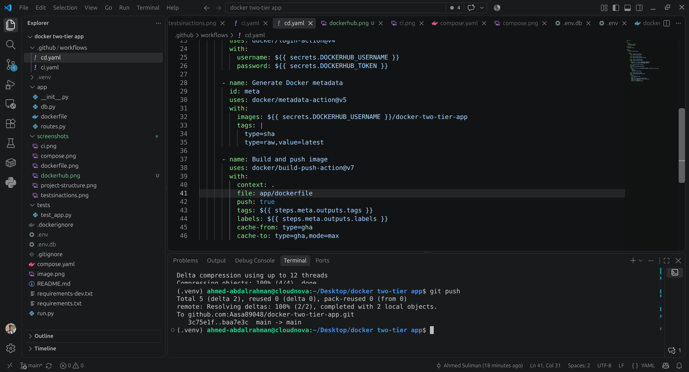
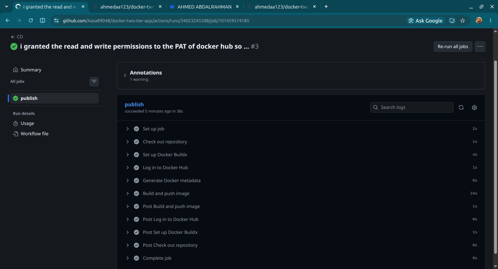
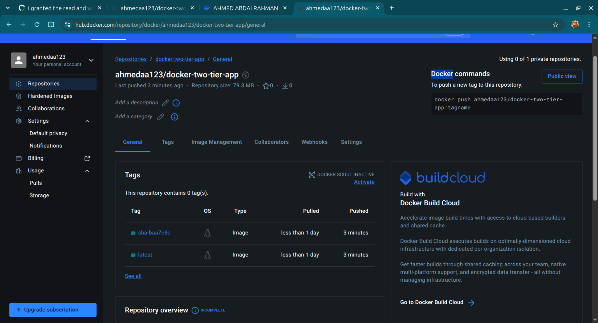

# Docker Two-Tier Flask Application

A containerized two-tier web application built with **Flask and MySQL**, designed to demonstrate **cloud-ready application deployment, containerization, CI/CD automation, and DevSecOps practices**.

The project implements automated testing, Docker image security scanning, versioned container image publishing, and a deployment-ready architecture that can be extended to AWS cloud infrastructure.

# Docker Two-Tier Flask Application

A containerized two-tier web application built with **Flask and MySQL**, designed to demonstrate **cloud-ready application deployment, containerization, CI/CD automation, and DevSecOps practices**.

The project implements automated testing, Docker image security scanning, versioned container image publishing, and a deployment-ready architecture that can be extended to AWS cloud infrastructure.

## Technologies

| Category | Technologies |
|---|---|
| Application | Python, Flask |
| Database | MySQL |
| Containerization | Docker, Docker Compose |
| CI/CD | GitHub Actions |
| Testing | Pytest |
| Security | Docker Scout |
| Registry | Docker Hub |
| Configuration | Environment Variables, GitHub Secrets |
| Storage | Docker Named Volumes |
| Web Server | Gunicorn |
| OS / Runtime | Linux, Python 3.12 |


## Security

- I run the production container as a **non-root user** to reduce container privileges.

- I use **GitHub Secrets** for Docker Hub authentication rather than storing credentials in the repository.

- I use **Docker Scout** to scan container images for known vulnerabilities.

- Sensitive local configuration files such as `.env` and `.env.db` are excluded from version control using `.gitignore`.


## Run Locally

### Prerequisites

- Docker
- Docker Compose
- Git

### Start the application

```bash
git clone https://github.com/Aasa89048/docker-two-tier-app.git
cd docker-two-tier-app
```
docker compose up --build

The API will be available at:

http://localhost:5000

Health check:

http://localhost:5000/api/health

Stop the application:

docker compose down


## Project Structure


## Application Containerization

- I used **multi-stage builds** to avoid unnecessary files and dependencies in the final image, keeping the production image smaller.
- I structured the Dockerfile so that the parts that change frequently are placed later. This allows Docker to reuse the already cached layers and makes rebuilds faster.
- I run the container as a **non-root user** to improve container security.
  


### Docker Compose

I used Docker Compose to orchestrate the application and database containers in a local environment.

- **Healthchecks** verify that the application and MySQL are actually healthy rather than only running.

- **Dependency conditions** prevent the application from starting before the database passes its healthcheck.

- A **named Docker volume** provides persistent MySQL storage across container restarts and recreation.

- **Restart policies** improve application resilience by automatically restarting failed containers.


## CI/CD Pipeline

The pipeline performs the following steps:

1. **Checkout** the source code.
2. **Start MySQL** as a GitHub Actions service container.
3. **Install Python dependencies**.
4. **Run automated tests** using Pytest.
5. **Build the Docker image**.
6. **Authenticate with Docker Hub** using GitHub Actions Secrets.
7. **Scan the Docker image** for known vulnerabilities using Docker Scout.

This creates an automated quality and security gate before changes are considered ready for deployment.


---


## Continuous Deployment (CD)

- I created a separate **CD workflow** using GitHub Actions to automatically build and publish the Docker image to Docker Hub whenever changes are pushed to the `main` branch.

- I used **Docker Buildx** to build the production image and **GitHub Secrets** to securely authenticate with Docker Hub.

- I configured **versioned image tags** using the Git commit SHA along with the `latest` tag, making it easier to track releases and identify the exact version of an image.

- The workflow creates a **reproducible deployment artifact** that can be pulled and deployed to a cloud environment.



- Github CD workflow



- Dockerhub repo with the pushed images



