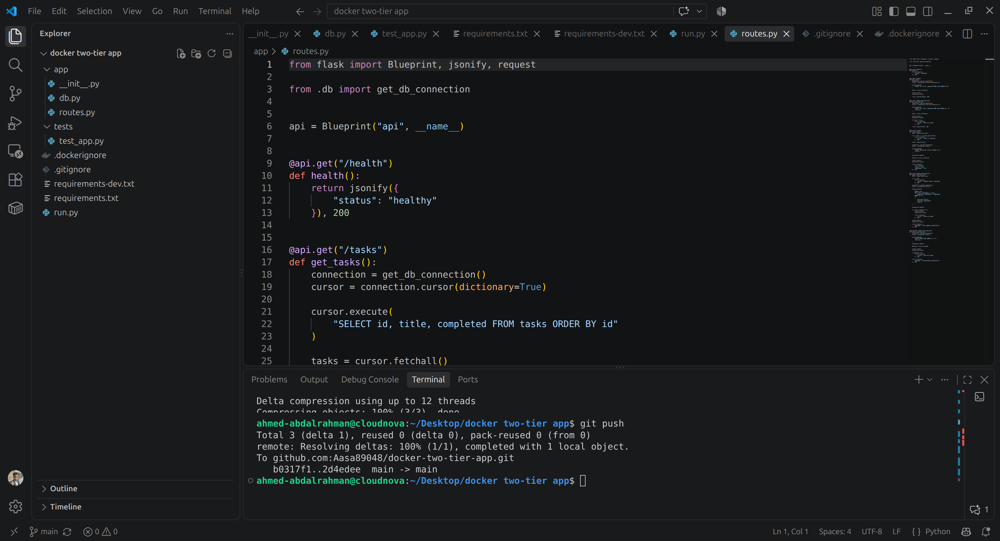
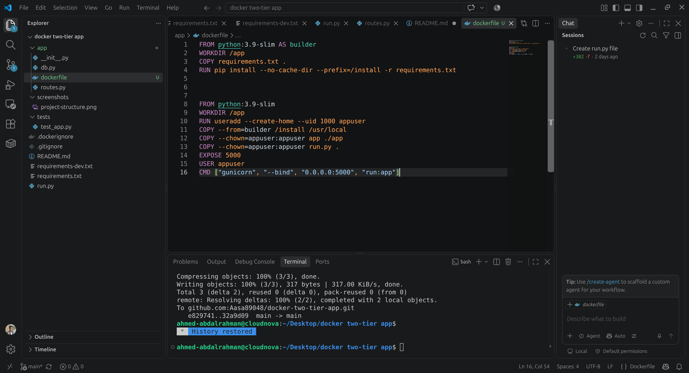
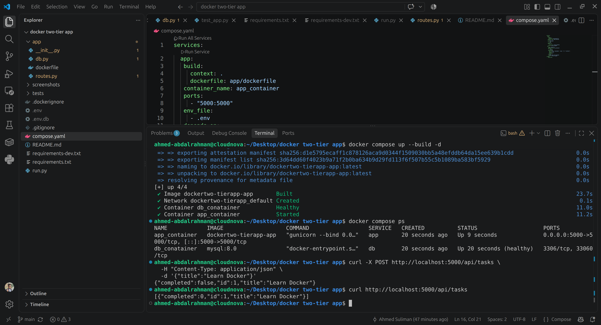

# Docker Two-Tier Flask Application

A two-tier application built with **Flask and MySQL**, containerized using **Docker and Docker Compose**.
The project focuses on Docker image optimization, container security, reliability, automated testing, and CI/CD using GitHub Actions.

## Project Structure

## Created Dockerfile 

- I used **multi-stage builds** to avoid unnecessary files and dependencies in the final image, keeping the production image smaller.
- I structured the Dockerfile so that the parts that change frequently are placed later. This allows Docker to reuse the already cached layers and makes rebuilds faster.
- I run the container as a **non-root user** to improve container security.
  

## Docker Compose

- I added healthchecks to make sure the app and database are healthy, not just running.
- I created a volume to persist database data beyond the container lifecycle.

