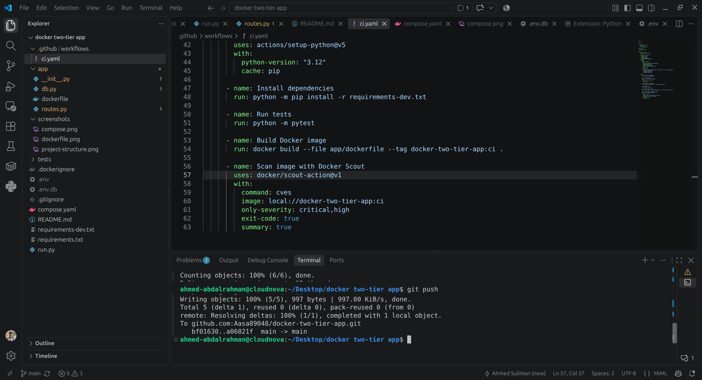
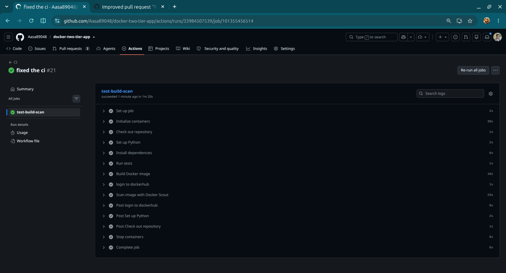

# Docker Two-Tier Flask Application

A production-oriented two-tier Flask application with MySQL, containerized using Docker and Docker Compose.

The project demonstrates practical **DevOps and cloud engineering practices**, including:
- Multi-stage Docker builds
- Non-root containers
- Container healthchecks
- Persistent database storage
- Automated testing with GitHub Actions
- Docker image vulnerability scanning with Docker Scout
- Secure credential management using GitHub Actions Secrets

## Project Structure

## Created Dockerfile 

- I used **multi-stage builds** to avoid unnecessary files and dependencies in the final image, keeping the production image smaller.
- I structured the Dockerfile so that the parts that change frequently are placed later. This allows Docker to reuse the already cached layers and makes rebuilds faster.
- I run the container as a **non-root user** to improve container security.
  

## Docker Compose

- I added **healthchecks** to make sure the app and database are healthy, not just running.
- I created a **named volume** to persist database data beyond the container lifecycle.
- i added **Dependency conditions** prevent the application from starting before MySQL is healthy.

## CI/CD Pipeline

The pipeline performs the following steps:

1. **Checkout** the source code.
2. **Start MySQL** as a GitHub Actions service container.
3. **Install Python dependencies**.
4. **Run automated tests** using Pytest.
5. **Build the Docker image**.
6. **Authenticate with Docker Hub** using GitHub Actions Secrets.
7. **Scan the Docker image** for known vulnerabilities using Docker Scout.

This creates an automated quality and security gate before changes are considered ready for deployment.

---

